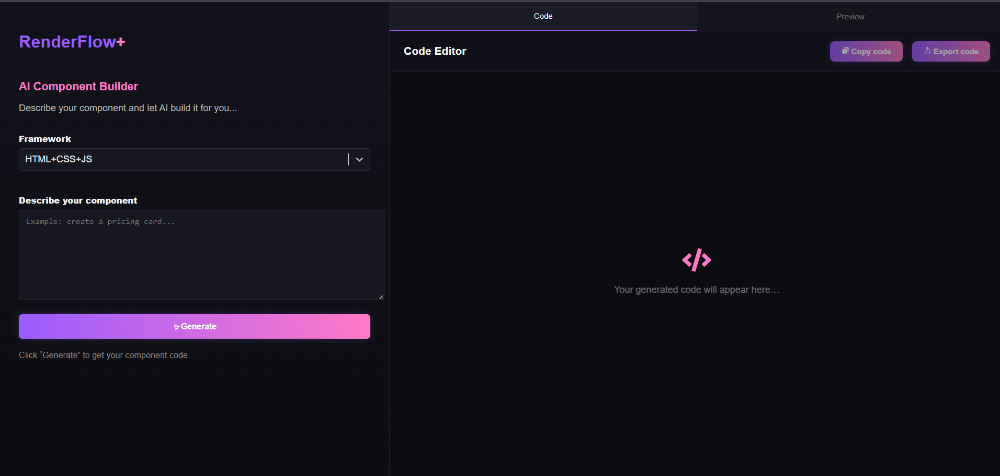
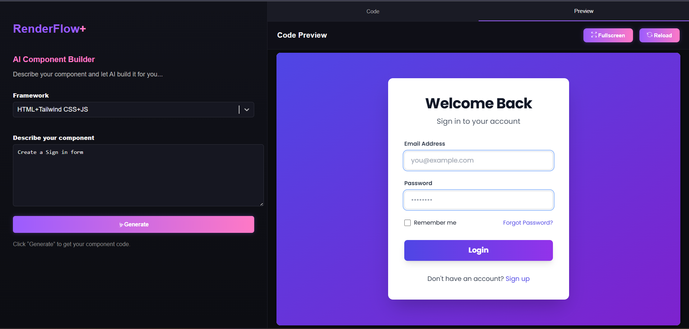
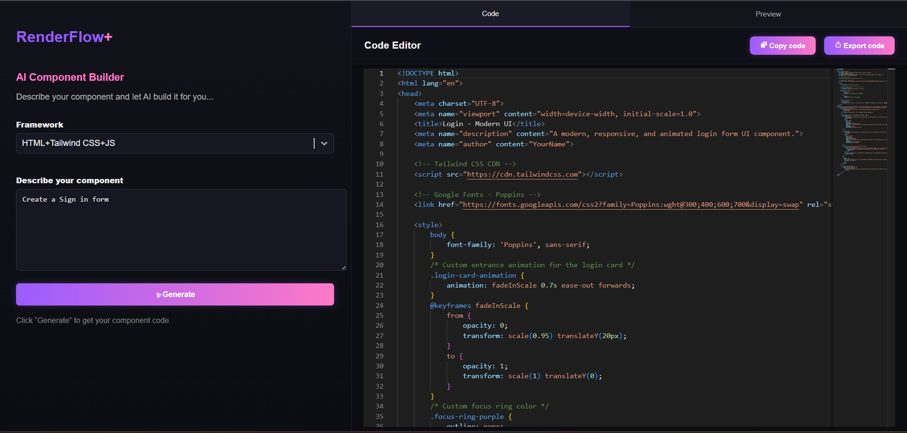

RenderFlow+

RenderFlow is a fast and simple AI-powered UI generator.
Just describe what you want, choose the framework, and the app instantly returns clean, ready-to-use UI code.

This project highlights my skills in React, API integration, prompt engineering, and building practical tools with a clean UI.

✨ Features

Generate complete UI components from a text description

Supports multiple frameworks (HTML, JS,Tailwind, etc.)

Simple and responsive interface

Handles API errors gracefully

Clean code output for easy copy and use

Prompt template stored in .env for better structure

🧩 How It Works

Enter your UI description

Select the framework

RenderFlow+ builds a dynamic prompt

Sends it to the OpenAI API

Returns a fully generated UI component

🖼️ Screenshots

🚀 Getting Started

1. Install dependencies
   npm install
2. Create .env
   VITE_OPENAI_KEY=your_api_key
   VITE_AI_PROMPT=your_prompt_here

3. Run the project
   npm run dev
   🎯 Purpose

I built RenderFlow+ to create a real, practical project that demonstrates my front-end skills, API handling, and ability to turn ideas into working tools.
It’s simple, clean, and focused — just like real-world production components should be.
